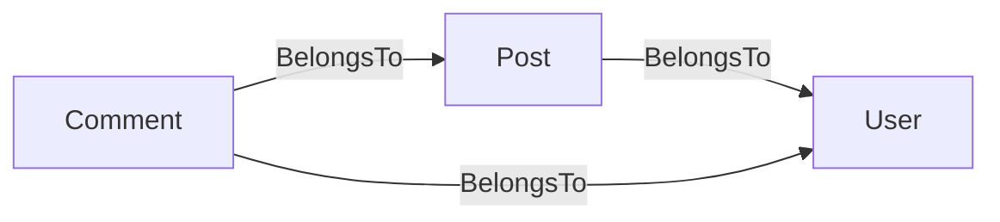

# gormtables

[中文文档](README.zh-CN.md)

`gormtables` is a code-generation tool that scans your GORM model packages,
resolves BelongsTo dependency relationships between models, and emits an
ordered Go slice for use with `db.AutoMigrate`.

```
go install github.com/hr3lxphr6j/gormtables@latest
```

---

## Why?

`gorm.AutoMigrate` accepts a variadic list of model pointers and creates (or
alters) the corresponding tables.  When your models have foreign-key
constraints the order matters: the referenced table must exist before the
referencing table can add its constraint.

Maintaining that order by hand is error-prone.  `gormtables` derives the
correct order automatically by reading the `gorm:"foreignKey:…"` struct tags
and topologically sorting the models.  The output is a plain Go source file
that is easy to review and diff in pull requests.

---

## Dependency semantics

`gormtables` only counts **BelongsTo** relationships as ordering constraints.

A field is classified as BelongsTo when **all** of the following are true:

1. The field has a `gorm:"foreignKey:<FK>"` tag.
2. The named `<FK>` field exists in the **same** struct (meaning this table
   owns the foreign-key column).
3. The field type is different from the enclosing struct (no self-references).

**HasMany / HasOne** associations are intentionally ignored because the foreign-
key column lives in the *other* table, so they impose no ordering constraint
on this table.

**Cycles** (two or more models depending on each other) are detected and
reported as an error listing the involved struct names.  Self-referential
associations (e.g. tree structures) are excluded from the dependency graph, so
they do not create false cycles.



For the graph above, `gormtables` produces the order:
`Comment → Post → User`
so AutoMigrate creates `users` first, then `posts`, then `comments`.

---

## Opt-in / opt-out rules

A struct is **included** if it satisfies at least one of:

| Rule | Example |
|------|---------|
| Anonymously embeds a base struct listed in `-base` | `BaseModel` (default) or `gorm.Model` |
| Carries the enable marker comment (see `-enable-marker`) | `// AutoMigrate:enable` |

A struct is **excluded** (regardless of the above) if it carries the disable
marker comment (see `-disable-marker`):

```go
// AutoMigrate:disable
type Draft struct {
    BaseModel
    Body string
}
```

---

## Usage

### go:generate

```go
//go:generate gormtables -models ./internal/model -out ./internal/db/tables.go
```

Then run:

```sh
go generate ./internal/db/...
```

### Command line

```sh
gormtables \
  -models ./internal/model \
  -out    ./internal/db/tables.go \
  -pkg    database \
  -var    autoMigrateTables
```

### Generated output example

Given models:

```go
// internal/model/user.go
type User struct {
    BaseModel
    Name string
}

// internal/model/post.go
type Post struct {
    BaseModel
    UserID uint64
    User   *User `gorm:"foreignKey:UserID"`
    Title  string
}
```

`gormtables` generates:

```go
// Code generated by gormtables; DO NOT EDIT.

package database

import (
    model "example.com/app/internal/model"
)

// autoMigrateTables is the ordered list of GORM models for AutoMigrate.
// Tables that are depended upon by others appear later in the slice so that
// foreign-key constraints can be satisfied during migration.
var autoMigrateTables = []any{
    &model.Post{},
    &model.User{},
}
```

Plug it in:

```go
if err := db.AutoMigrate(autoMigrateTables...); err != nil {
    log.Fatal(err)
}
```

---

## Flag reference

| Flag | Default | Description |
|------|---------|-------------|
| `-models` | *(required)* | Comma-separated list of model directories to scan |
| `-out` | *(required)* | Output file path |
| `-pkg` | `database` | Package name written in the generated file |
| `-var` | `autoMigrateTables` | Name of the generated `[]any` variable |
| `-base` | `BaseModel,gorm.Model` | Comma-separated base-embed names that qualify a struct |
| `-enable-marker` | `AutoMigrate:enable` | Comment text that force-includes a struct |
| `-disable-marker` | `AutoMigrate:disable` | Comment text that force-excludes a struct |
| `-tag` | `gorm` | Struct-tag key used for foreign-key inspection |

---

## License

MIT — see [LICENSE](LICENSE).
