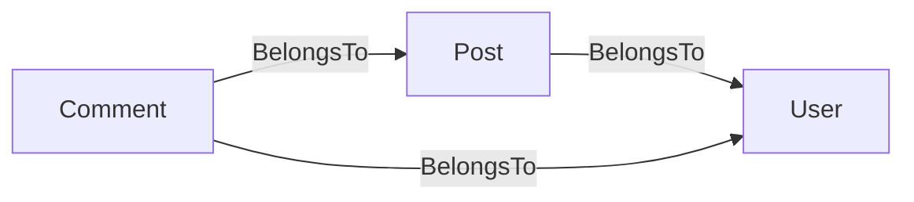

# gormtables

`gormtables` 是一个代码生成工具，用于扫描 GORM 模型包，分析模型之间的 BelongsTo 依赖关系，并生成有序的 Go 切片，供 `db.AutoMigrate` 使用。

```
go install github.com/hr3lxphr6j/gormtables@latest
```

---

## 为什么需要它？

`gorm.AutoMigrate` 接受一个可变参数的模型指针列表，并创建（或修改）对应的数据库表。当模型之间存在外键约束时，顺序至关重要：被引用的表必须在引用表之前创建，外键约束才能建立成功。

手动维护这个顺序容易出错。`gormtables` 通过读取结构体标签中的 `gorm:"foreignKey:…"` 信息，自动推导出正确的顺序（拓扑排序）。生成结果是一个普通的 Go 源文件，便于在 Pull Request 中审阅和差异对比。

---

## 依赖关系语义

`gormtables` 只将 **BelongsTo** 关系计为排序约束。

当以下条件**全部满足**时，字段被判定为 BelongsTo：

1. 字段带有 `gorm:"foreignKey:<FK>"` 标签。
2. 命名的 `<FK>` 字段存在于**同一个**结构体中（即该表拥有外键列）。
3. 字段类型与所在结构体不同（排除自引用）。

**HasMany / HasOne** 关系会被主动忽略，因为外键列位于*另一张*表，对本表的迁移顺序没有约束。

**循环依赖**（两个或多个模型互相依赖）会被检测并报错，错误信息中列出涉及的结构体名称。自引用关系（如树形结构）已从依赖图中排除，不会产生误报的环。



对于上图，`gormtables` 生成的顺序为：
`Comment → Post → User`
AutoMigrate 将先创建 `users`，再创建 `posts`，最后创建 `comments`。

---

## 包含/排除规则

满足以下任意一条，结构体将被**包含**：

| 规则 | 示例 |
|------|------|
| 匿名嵌入了 `-base` 中列出的基类结构体 | `BaseModel`（默认）或 `gorm.Model` |
| 带有启用标记注释（见 `-enable-marker`） | `// AutoMigrate:enable` |

无论以上规则如何，若结构体带有禁用标记注释（见 `-disable-marker`），则**强制排除**：

```go
// AutoMigrate:disable
type Draft struct {
    BaseModel
    Body string
}
```

---

## 使用方法

### go:generate

```go
//go:generate gormtables -models ./internal/model -out ./internal/db/tables.go
```

然后运行：

```sh
go generate ./internal/db/...
```

### 命令行

```sh
gormtables \
  -models ./internal/model \
  -out    ./internal/db/tables.go \
  -pkg    database \
  -var    autoMigrateTables
```

### 生成结果示例

给定如下模型：

```go
// internal/model/user.go
type User struct {
    BaseModel
    Name string
}

// internal/model/post.go
type Post struct {
    BaseModel
    UserID uint64
    User   *User `gorm:"foreignKey:UserID"`
    Title  string
}
```

`gormtables` 生成：

```go
// Code generated by gormtables; DO NOT EDIT.

package database

import (
    model "example.com/app/internal/model"
)

// autoMigrateTables is the ordered list of GORM models for AutoMigrate.
// Tables that are depended upon by others appear later in the slice so that
// foreign-key constraints can be satisfied during migration.
var autoMigrateTables = []any{
    &model.Post{},
    &model.User{},
}
```

接入方式：

```go
if err := db.AutoMigrate(autoMigrateTables...); err != nil {
    log.Fatal(err)
}
```

---

## 参数说明

| 参数 | 默认值 | 说明 |
|------|--------|------|
| `-models` | *(必填)* | 逗号分隔的模型目录列表 |
| `-out` | *(必填)* | 输出文件路径 |
| `-pkg` | `database` | 生成文件的包名 |
| `-var` | `autoMigrateTables` | 生成的 `[]any` 变量名 |
| `-base` | `BaseModel,gorm.Model` | 逗号分隔的基类嵌入名，满足其一则包含该结构体 |
| `-enable-marker` | `AutoMigrate:enable` | 强制包含某结构体的注释标记文本 |
| `-disable-marker` | `AutoMigrate:disable` | 强制排除某结构体的注释标记文本 |
| `-tag` | `gorm` | 用于外键检查的结构体标签键名 |

---

## 许可证

MIT — 详见 [LICENSE](LICENSE)。
